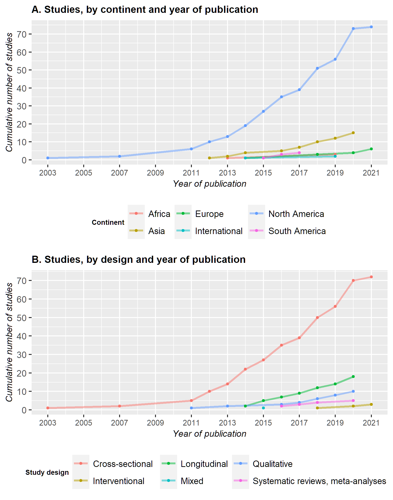
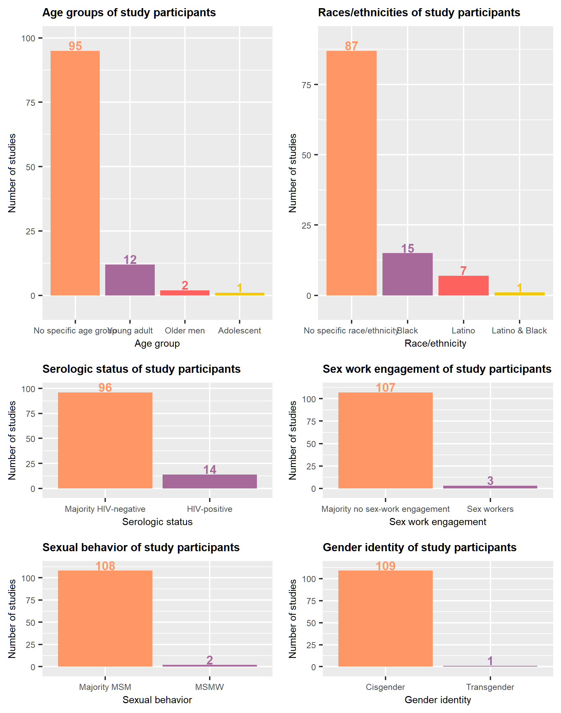

```{r setup, include=FALSE}
knitr::opts_chunk$set(echo = FALSE)
library(bookdown)
```

# Results

## Literature search

The electronic search identified 769 references and our handsearch of reference lists resulted in the addition of the seminal study by Stall and colleague @Stall2003 . After duplicates removal, 277 records were left to be screened for inclusion.

After screening the title and abstract, 109 records were excluded. The two main reasons for exclusion at this stage were that MSM were not the main study population (n=46) and that syndemic was not the main focus of the paper (n=34). 29 studies were excluded because the type of publication did not meet our inclusion criteria.

The full texts of the 168 remaining references were obtained and read; 59 were excluded after this phase. During the previous step, we had decided to tentatively include papers in which the sample was not entirely comprised of MSM. After reviewing the full paper, we decided to exclude studies if the MSM data was aggregated with data from another population (n=9), most commonly transgender women. The rationale for this decision was to keep the focus clearly on MSM.

The PRISMA flowchart generated by DistillerSR can be found in Figure \@ref(fig:PRISMA)

```{r PRISMA, fig.cap = "PRISMA flowchart of the included search strategy"}
knitr::include_graphics("Files/images/PRISMA.png")

```

## How are studies concerning Syndemic Theory applied to MSM conducted?

### General characteristics of included studies

```{r General_characteristics_data_preparation, message=FALSE, warning=FALSE, include=FALSE, paged.print=FALSE}
#Load required packages :
library(tidyverse)
library(readr)
library(scales)
library(ggplot2)
library(ggpubr)
library(sunburstR)
library(d3r)

#Load the data from the .csv files
source("./scripts/read_data.R", local = knitr::knit_global())

#Source the scripts used to manipulate the data from the .csv files
source("./scripts/create_year_design.R", local = knitr::knit_global())
source("./scripts/create_location_data.R", local = knitr::knit_global())
source("./scripts/create_sample.R", local = knitr::knit_global())

#Create the plot 
source("./scripts/create_plot_year.R", local = knitr::knit_global())


```

The publication date of the studies ranges from `r min(year_design$year)` to `r max(year_design$year)` with a marked increase in the number papers published annually from 2013 onward as illustrated in Figure \@ref(fig:PlotYear). There is also an increase in the diversity of the studies, both in the type of design used and the continents where the studies were conducted.

```{r PlotYear, fig.cap = "Plot of the cumulative number of studies published yearly, grouped by continent (A) and design (B)"}



```

However, despite the emerging diversity, the vast majority of studies are conducted in North America (N = `r .North_America_studies`), with a large predominance of studies in the United States of America (N= `r .USA_studies`). The majority of the remaining studies were then located in Asia (N = `r .Asia_studies`) or in Europe (N = `r .Europe_studies`). South America and Africa were the least represented continents, with only `r .South_America_studies` and `r .Africa_studies` studies respectively.

In terms of design, a similar pattern appears, with most of the studies employing a cross-sectional design (N = `r .N_cross_sec`). The number of longitudinal studies grew steadily since 2014 and represents `r .N_long/109` papers to this day. Qualitative studies are under-represented, with only `r .N_qual` papers. Of note, we only identified 1 mixed design @buttram2015 ; this study employed a cross-sectional design for the quantitative part and in-depth interviews analyzed through grounded theory for the qualitative part. The first systematic reviews and meta-analyses were published, in `r min(year_design$year[year_design$design == "Systematic reviews, meta-analyses"])`, while the first interventional studies were published in `r min(year_design$year[year_design$design == "Interventional"])`.

Finally, the median sample size of the studies was `r median(sample$sample_size)` (range : `r min(sample$sample_size)` - `r number(max(sample$sample_size))`) and the mean age of the participants, when reported ranged from `r min(sample$age, na.rm = T)` to `r round(max(sample$age, na.rm = T), digits = 0)`.

### Subpopulations studied

```{r Subpopulation_data_prep, message=FALSE, warning=FALSE, include=FALSE}
library(cowplot)
source("./scripts/create_population_data.R", local = knitr::knit_global())
source("./scripts/create_population_plot.R", local = knitr::knit_global())

```

Fewer than half of the studies (N = `r sum(!is.na(population$subpopulation))` ) focus on a subpopulation of MSM. In this review, we identified 6 kind of MSM subpopulations studied in syndemic literature : (a) young MSM and older MSM ; (b) MSM from a racial/ethnic minority ; (c) MSM living with HIV ; (d) MSM engaged in sex work ; (e) Men who have Sex with Men and Women (MSMW) ; and (f) transgender MSM.

Among studies focusing on a specific age group, `r sum(population$age == "Young adult")` studies focus on young adults, `r sum(population$age == "Older men")` studies focus on older MSM[@zepf2020; @Halkitis2012] and `r sum(population$age == "Adolescent")` study focuses on adolescents[@Perry]. Of note, the two studies on older MSM are both entirely composed of a sample of older MSM living with HIV.

Black MSM (BMSM) are the most studied MSM from a racial/ethnic minority (N= `r sum(population$race_ethnicity == "Black")`) but studies focusing on them still represent only `r percent(sum(population$race_ethnicity == "Black")/104)` of our sample. Among these studies, `r .N_YBMSM` studies are composed of young BMSM[@Maiorana; @Reed2016] and `r .N_MSM_SW` study focuses on Black MSM engaged in sex work[@chandler2020].\
`r sum(population$race_ethnicity == "Latino")` studies focus on Latino MSM (LMSM) and `r .N_LMSMW` of these studies focus on Latino MSMW[@Munoz-Laboy2018]. Furthermore, `r sum(population$race_ethnicity == "Latino & Black")` study focus on both BMSM and LMSM[@cassels2020].

Concerning the serologic status of MSM in syndemic literature, `r sum(population$serologic_status == "HIV-positive")` studies are entirely comprised of a sample of MSM living with HIV. Apart from the aforementioned studies on older MSM living with HIV, `r sum(population$serologic_status == "HIV-positive" & population$age == "Young adult")` studies focus on young MSM living with HIV[@Lyons2013; @Bruce2011] . Notably, we identified no studies conducted on racial minority MSM living with HIV.

Finally, the least represented subpopulation of MSM in this review are MSMW (N = `r sum(population$sex_behav == "MSMW")`), MSM engaged in sex work (N = `r sum(population$sex_work == "Sex workers")`) and transgender MSM (N = `r sum(population$gender_identity == "Transgender")`). Strikingly, transgender MSM, in addition to being the focus of only one study[@Reisner2016a] are, by design, excluded from every other study whereas other MSM subpopulation are at least partially represented in most of the samples.

Figure \@ref(fig:PlotPop) gives a visual representation of MSM subpopulation's representation in the studies included in this paper.

In order to have the most comprehensive knowledge of the representation of MSM subpopulations in syndemic literature, we also took into account studies who did not focus on any subpopulation in particular but who presented disaggregated data and analyses for one or more MSM subpopulation.\
`r .N_disaggregated` studies presented such data : `r .N_dis_BMSMW` for Black MSMW[@dyer2020], `r .N_dis_MSMW` for MSMW[@branstrom; @Mustanski2014; @friedman2014; @ferlatte2018], `r .N_dis_HIVMSM` for MSM living with HIV[@Kurtz2012; @ng2020] and `r .N_dis_LBMSM` for Latino and Black MSM[@Mustanski2017].

```{r PlotPop, fig.cap = "Number of studies focusing on a MSM subpopulation, by kind of subpopulation"}


```

### Syndemic conditions and their measurement

### Outcomes and their measurement

### Interventions

## How is the concept of interaction explored in syndemic research applied to MSM?

### Statistics used to show an interaction

### Proposed mechanisms of interaction

## What were the key findings of these studies?

# Discussion

# Conclusion

# References

::: {#refs}
:::
