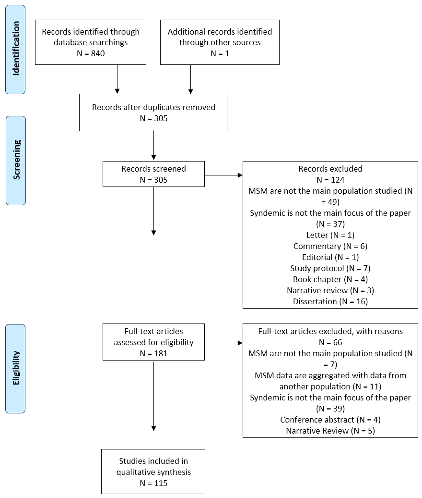

```{r setup, include=FALSE}
knitr::opts_chunk$set(echo = FALSE)
library(bookdown)
```

# Results

## Literature search

The electronic search identified 769 citations and our handsearch of reference lists resulted in the addition of the seminal study by Stall and colleague @Stall2003 . After duplicates removal, 277 unique references were left to be screened for inclusion.

Among these references, 109 were excluded after reading the title and abstract. The two main reasons for exclusion at this stage were that MSM were not the main population of the study (n=46) or that syndemic was not the main focus of the paper (n=34). 29 additional studies were excluded because the type of publication did not meet our inclusion criteria.

The full texts of the 168 remaining references were obtained and read, which lead to the exclusion of 59 citations. During the previous step, we decided to include papers in which the sample was not entirely comprised of MSM. After reading the full paper, we opted to exclude the studies if the MSM data was aggregated with data from another population (n=9), most commonly transgender women. The rationale for this decision was to keep the focus clearly on MSM.

The PRISMA flowchart generated by DistillerSR can be found in Figure \@ref(fig:PRISMA)

```{r PRISMA, fig.cap = "PRISMA flowchart of the included search strategy"}


knitr::knit_exit()

```


## How are studies concerning Syndemic Theory applied to MSM conducted?

### General characteristics of included studies

```{r General_characteristics_data_preparation, message=FALSE, warning=FALSE, include=FALSE, paged.print=FALSE}
source("./scripts/read_overview.R", local = knitr::knit_global())
source("./scripts/create_year_data.R", local = knitr::knit_global())
source("./scripts/create_design_data.R", local = knitr::knit_global())
source("./scripts/create_location_data.R", local = knitr::knit_global())


```

### Subpopulations studied

### Syndemic conditions and their measurement

### Outcomes and their measurement

### Interventions

## How is the concept of interaction explored in syndemic research applied to MSM?

### Statistics used to show an interaction

### Proposed mechanisms of interaction

## What were the key findings of these studies?

# Discussion

# Conclusion

# References

::: {#refs}
:::
