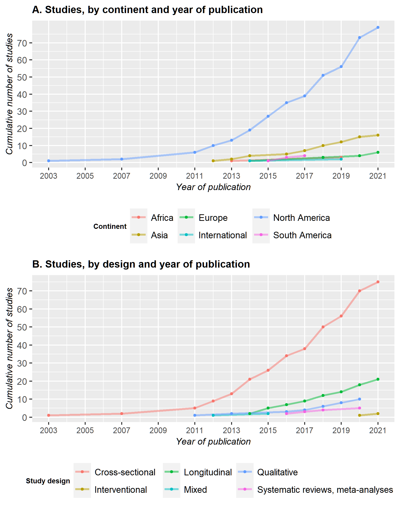

```{r setup, include=FALSE}
knitr::opts_chunk$set(echo = FALSE)
library(bookdown)
library(officedown)
```

```{r packages_data, message=FALSE, warning=FALSE, include=FALSE, paged.print=FALSE}

#Load required packages :
library(tidyverse)
library(readr)
library(scales)
library(ggplot2)
library(ggpubr)
library(sunburstR)
library(d3r)

#Load the data from the .csv files
source("./scripts/read_data.R", local = knitr::knit_global())


```

# Results

## Literature search

The electronic search identified 769 references and our handsearch of reference lists resulted in the addition of the seminal study by Stall and colleague @Stall2003 . After duplicates removal, 277 records were left to be screened for inclusion.

After screening the title and abstract, 109 records were excluded. The two main reasons for exclusion at this stage were that MSM were not the main study population (n=46) and that syndemic was not the main focus of the paper (n=34). 29 studies were excluded because the type of publication did not meet our inclusion criteria.

The full texts of the 168 remaining references were obtained and read; 59 were excluded after this phase. During the previous step, we had decided to tentatively include papers in which the sample was not entirely comprised of MSM. After reviewing the full paper, we decided to exclude studies if the MSM data was aggregated with data from another population (n=9), most commonly transgender women. The rationale for this decision was to keep the focus clearly on MSM.

The PRISMA flowchart generated by DistillerSR can be found in Figure \@ref(fig:PRISMA)

```{r PRISMA, fig.cap= "PRISMA flowchart of the search strategy", fig.height=7.5, fig.id="PRISMA", fig.width=7, fig.align='center'}
knitr::include_graphics("Files/images/PRISMA.png")

```

## How are studies concerning Syndemic Theory applied to MSM conducted?

### General characteristics of included studies

```{r general_characteristics_data_preparation, message=FALSE, warning=FALSE, include=FALSE, paged.print=FALSE}


#Source the scripts used to manipulate the data from the .csv files
source("./scripts/create_year_design.R", local = knitr::knit_global())
source("./scripts/create_location_data.R", local = knitr::knit_global())
source("./scripts/create_sample.R", local = knitr::knit_global())

#Create the plot 
source("./scripts/create_plot_year.R", local = knitr::knit_global())


```

The publication date of the studies ranges from `r min(year_design$year)` to `r max(year_design$year)` with a marked increase in the number papers published annually from 2013 onward as illustrated in Figure \@ref(fig:PlotYear). There is also an increase in the diversity of the studies, both in the type of design used and the continents where the studies were conducted.

```{r plot_year, fig.cap="Plot of the cumulative number of studies published yearly", fig.height=7, fig.id="PlotYear", fig.width=5.5, fig.align='center'}



```

However, despite the emerging diversity, the vast majority of studies are conducted in North America (N = `r .North_America_studies`), with a large predominance of studies in the United States of America (N= `r .USA_studies`). The majority of the remaining studies were then located in Asia (N = `r .Asia_studies`) or in Europe (N = `r .Europe_studies`). South America and Africa were the least represented continents, with only `r .South_America_studies` and `r .Africa_studies` studies respectively.

In terms of design, a similar pattern appears, with most of the studies employing a cross-sectional design (N = `r .N_cross_sec`). The number of longitudinal studies grew steadily since 2014 and represents `r .N_long/109` papers to this day. Qualitative studies are under-represented, with only `r .N_qual` papers. Of note, we only identified 1 mixed design @buttram2015 ; this study employed a cross-sectional design for the quantitative part and in-depth interviews analyzed through grounded theory for the qualitative part. The first systematic reviews and meta-analyses were published, in `r min(year_design$year[year_design$design == "Systematic reviews, meta-analyses"])`, while the first interventional studies were published in `r min(year_design$year[year_design$design == "Interventional"])`.

Finally, the median sample size of the studies was `r median(sample$sample_size)` (range : `r min(sample$sample_size)` - `r number(max(sample$sample_size))`) and the mean age of the participants, when reported ranged from `r min(sample$age, na.rm = T)` to `r round(max(sample$age, na.rm = T), digits = 0)`.

### Subpopulations studied

```{r Subpopulation_data_prep, message=FALSE, warning=FALSE, include=FALSE}
library(cowplot)
source("./scripts/create_population_data.R", local = knitr::knit_global())
source("./scripts/create_population_plot.R", local = knitr::knit_global())

```

Fewer than half of the studies (N = `r sum(!is.na(population$subpopulation))` ) focus on a subpopulation of MSM. In this review, we identified 6 kind of MSM subpopulations studied in syndemic literature : (a) young MSM and older MSM ; (b) MSM from a racial/ethnic minority ; (c) MSM living with HIV ; (d) MSM engaged in sex work ; (e) Men who have Sex with Men and Women (MSMW) ; and (f) transgender MSM.

Among studies focusing on a specific age group, `r sum(population$age == "Young adult")` studies focus on young adults, `r sum(population$age == "Older men")` studies focus on older MSM[@zepf2020; @Halkitis2012] and `r sum(population$age == "Adolescent")` study focuses on adolescents[@Perry]. Of note, the two studies on older MSM are both entirely composed of a sample of older MSM living with HIV.

Black MSM (BMSM) are the most studied MSM from a racial/ethnic minority (N= `r sum(population$race_ethnicity == "Black")`) but studies focusing on them still represent only `r percent(sum(population$race_ethnicity == "Black")/104)` of our sample. Among these studies, `r .N_YBMSM` studies are composed of young BMSM[@Maiorana; @Reed2016] and `r .N_MSM_SW` study focuses on Black MSM engaged in sex work[@chandler2020].\
`r sum(population$race_ethnicity == "Latino")` studies focus on Latino MSM (LMSM) and `r .N_LMSMW` of these studies focus on Latino MSMW[@Munoz-Laboy2018]. Furthermore, `r sum(population$race_ethnicity == "Latino & Black")` study focus on both BMSM and LMSM[@cassels2020].

Concerning the serologic status of MSM in syndemic literature, `r sum(population$serologic_status == "HIV-positive")` studies are entirely comprised of a sample of MSM living with HIV. Apart from the aforementioned studies on older MSM living with HIV, `r sum(population$serologic_status == "HIV-positive" & population$age == "Young adult")` studies focus on young MSM living with HIV[@Lyons2013; @Bruce2011] . Notably, we identified no studies conducted on racial minority MSM living with HIV.

Finally, the least represented subpopulation of MSM in this review are MSMW (N = `r sum(population$sex_behav == "MSMW")`), MSM engaged in sex work (N = `r sum(population$sex_work == "Sex workers")`) and transgender MSM (N = `r sum(population$gender_identity == "Transgender")`). Strikingly, transgender MSM, in addition to being the focus of only one study[@Reisner2016a] are, by design, excluded from every other study whereas other MSM subpopulation are at least partially represented in most of the samples.

Figure \@ref(fig:PlotPop) gives a visual representation of MSM subpopulation's representation in the studies included in this paper.

In order to have the most comprehensive knowledge of the representation of MSM subpopulations in syndemic literature, we also took into account studies who did not focus on any subpopulation in particular but who presented disaggregated data and analyses for one or more MSM subpopulation.\
`r .N_disaggregated` studies presented such data : `r .N_dis_BMSMW` for Black MSMW[@dyer2020], `r .N_dis_MSMW` for MSMW[@branstrom; @Mustanski2014; @friedman2014; @ferlatte2018], `r .N_dis_HIVMSM` for MSM living with HIV[@Kurtz2012; @ng2020] and `r .N_dis_LBMSM` for Latino and Black MSM[@Mustanski2017].

```{r plot_population, fig.cap="Number of studies focusing on a MSM subpopulation", fig.height=7, fig.id="PlotPop", fig.width=5.5, fig.align='center'}


```

### Syndemic conditions and their measurement

```{r syndemic_network_script, include=FALSE}

source("./scripts/create_syndemic_network.R", local = knitr::knit_global())


```

We identified `r nrow(nodes)` different syndemic conditions in the `r nrow(summary_quantitative)` quantitative studies we included : depression or depressive symptoms (N = `r nodes$studies[nodes$label == "depression"]`), intimate partner violence [IPV] (N = `r nodes$studies[nodes$label == "IPV"]`), substance use (N = `r nodes$studies[nodes$label == "substance_use"]`), childhood sexual abuse [CSA] (N = `r nodes$studies[nodes$label == "CSA"]`), polysubstance use (N = `r nodes$studies[nodes$label == "polysubstance"]`) , binge drinking (N = `r nodes$studies[nodes$label == "binge"]`), sexual compulsivity (N = `r nodes$studies[nodes$label == "sex_comp"]`), alcohol use disorder [AUD] (N = `r nodes$studies[nodes$label == "AUD"]`), suicidal thoughts and/or attempts (N = `r nodes$studies[nodes$label == "suicide"]`), sexual risk behaviors (N = `r nodes$studies[nodes$label == "sexual_risk"]`), experiences of violence (N = `r nodes$studies[nodes$label == "violence"]`), anxiety (N = `r nodes$studies[nodes$label == "anxiety"]`), substance use disorder [SUD] (N = `r nodes$studies[nodes$label == "substance_use_disorder"]`), alcohol use (N = `r nodes$studies[nodes$label == "alcohol_use"]`), discrimination (N = `r nodes$studies[nodes$label == "discrimination"]`), post-traumatic stress disorder [PTSD] (N = `r nodes$studies[nodes$label == "CSA"]`), chemsex (N = `r nodes$studies[nodes$label == "chemsex"]`), loneliness (N = `r nodes$studies[nodes$label == "loneliness"]`), incarceration (N = `r nodes$studies[nodes$label == "incarceration"]`), unstable housing (N = `r nodes$studies[nodes$label == "unstable_housing"]`), tobacco use (N = `r nodes$studies[nodes$label == "tobacco_use"]`), general mental distress (N = `r nodes$studies[nodes$label == "distress"]`), low social support (N = `r nodes$studies[nodes$label == "social_support"]`), low self-esteem (N = `r nodes$studies[nodes$label == "esteem"]`), internalised homophobia (N = `r nodes$studies[nodes$label == "internalised_homophobia"]`), exchange sex (N = `r nodes$studies[nodes$label == "exchange_sex"]`), sexually transmitted infections [STI] (N = `r nodes$studies[nodes$label == "STI"]`), childhood abuse (N = `r nodes$studies[nodes$label == "childhood"]`), intravenous drug use [IDU] (N = `r nodes$studies[nodes$label == "IDU"]`), poverty (N = `r nodes$studies[nodes$label == "poverty"]`), unemployment (N = `r nodes$studies[nodes$label == "unemployment"]`), poor healthcare access (N = `r nodes$studies[nodes$label == "healthcare_access"]`), involuntary subordination (N = `r nodes$studies[nodes$label == "subordination"]`), HIV diagnosis (N = `r nodes$studies[nodes$label == "HIV"]`), hostility (N = `r nodes$studies[nodes$label == "hostility"]`), stress (N = `r nodes$studies[nodes$label == "stress"]`), experience of trauma (N = `r nodes$studies[nodes$label == "trauma"]`), school bullying (N = `r nodes$studies[nodes$label == "bullying"]`), sleep disturbance (N = `r nodes$studies[nodes$label == "sleep_disturbance"]`), cognitive escape (N = `r nodes$studies[nodes$label == "escape"]`), attention deficit hyperactivity disorder [ADHD] (N = `r nodes$studies[nodes$label == "ADHD"]`), impulsivity (N = `r nodes$studies[nodes$label == "impulsivity"]`), hypersexuality (N = `r nodes$studies[nodes$label == "hypersexuality"]`), alexithymia (N = `r nodes$studies[nodes$label == "alexithymia"]`), poor physical health (N = `r nodes$studies[nodes$label == "physical_health"]`) and frequenting gay social venues (N = `r nodes$studies[nodes$label == "venues"]`).

We chose to distinguish alcohol use disorder, binge drinking and alcohol use instead of merging them in a broad "alcohol-related syndemic condition". Some authors also considered "heavy drinking" [@Martinez2016a; @martinez2020] or "heavy alcohol use"[@Mimiaga2015b] but we chose to aggregate these conditions under "binge drinking" for clarity. Similarly, we distinguished substance use, substance use disorder, intravenous drug use, polysubstance use, marijuana use, tobacco use and chemsex since they differ in potential harm and context of use.

```{r Stall_conditions, include=FALSE}
.Stall_conditions <- summary_quantitative %>%
  filter(!is.na(CSA) | (!is.na(depression) | (!is.na(polysubstance) | (!is.na(IPV)))))

```

Despite the important number of syndemic conditions studied in the literature, the impact of the seminal study by Stall et al.[@Stall2003] is striking as the conditions in this paper (depression, IPV, CSA and polysubstance use) are among the five most studied conditions in the field. Furthermore, `r percent(nrow(.Stall_conditions)/nrow(summary_quantitative))` of the quantitative studies included in our review consider at least one of the four conditions studied by Stall and colleagues as part of a syndemic.

In order to better understand the connections between the syndemic conditions in the studies we elaborated a network plot (Figure \@ref(fig:SyndemicNetwork)). Nodes represent the syndemic conditions studied in the literature and edges are drawn between two nodes when two conditions are studied in the same research paper. Furthermore, edges between nodes are thicker as the two conditions are frequently studied together.

In this graph, we divided each conditions into 4 categories : mental health (e.g. depression, anxiety, PTSD), social conditions (e.g. substance use, loneliness), structural conditions (e.g. unemployment, healthcare access) and physical health (e.g. STI, HIV) . When viewing this graph, it is readily apparent that structural syndemic conditions and physical health-related syndemic conditions are way less central than social syndemic conditions and mental health-related syndemic conditions.

Regarding the edges of the network, we identified `r nrow(edges)` pairs of syndemic conditions. However, nearly half of these pairs of conditions (N = `r nrow(.edges_1)`) appear in only one research paper. On the other hand , the most studied pairs of syndemic conditions were depression and IPV (N = `r edges$weight[edges$from == 1 & edges$to == 4]`), depression and substance use (N = (N = `r edges$weight[edges$from == 1 & edges$to == 2]`), depression and CSA (N = `r edges$weight[edges$from == 1 & edges$to == 10]`), depression and polysubstance use (N = `r edges$weight[edges$from == 1 & edges$to == 11]`) and IPV and CSA (N = `r edges$weight[edges$from == 4 & edges$to == 10]`).

We also computed centrality indices for this network, namely degree centrality, the sum of weight in the network, closeness centrality, the inverse of the total length of the paths from a node to all other nodes, and betweennness, the number of shortest path passing through a node[@opsahl2010].\
Because the weight of the nodes in this network corresponds to the number of studies in which the syndemic conditions appear, degree centrality of each node does is nearly perfectly correlated to the number of studies in which the syndemic condition was studied (`r paste0("r(", .cor_degree$parameter,")", " = ", round(.cor_degree$estimate, digits = 2), ", ", pvalue(.cor_degree$p.value, accuracy = 0.01, decimal.mark = ".", add_p = TRUE))`).\
Closeness centrality and betweenness centrality are also strongly correlated to the number of studies `r paste0("(r(", .cor_closeness$parameter,")", " = ", round(.cor_closeness$estimate, digits = 2), ", ", pvalue(.cor_closeness$p.value, accuracy = 0.01, decimal.mark = ".", add_p = TRUE), " and r(", .cor_betweenness$parameter,")", " = ", round(.cor_betweenness$estimate, digits = 2), ", ", pvalue(.cor_betweenness$p.value, accuracy = 0.01, decimal.mark = ".", add_p = TRUE), " respectively)")`. Interestingly, the betweenness centrality of unstable housing is notably high given the low number of studies taking this syndemic condition into account (N = `r nodes$studies[nodes$label == "unstable_housing"]`). Betweenness centrality can be seen as the extent of brokerage a node can exert on a network [@zweig2016]. Moreover, the three structural syndemic conditions "unstable housing", "incarceration" and "poverty" are mostly connected between each others. In other words, in syndemic literature, unstable housing acts as a bridge, notably between the two aforementioned structural syndemic conditions and the rest of the syndemic conditions. Indeed, unstable housing as been studied alongside `r nrow(.edges_UH)` other syndemic conditions : depression, substance use, IPV, binge drinking, sexual compulsivity, IDU, CSA, polysubstance use, incarceration, poverty, unemployment, discrimination, poor healthcare access, alcohol use and violence.

```{r syndemic_network_plot, fig.cap="Network of the syndemic conditions studied in quantitative research. The centrality of the nodes gives an indication on the importance of the condition in the literature, the most studied conditions being the most central. Moreover, each node is circled by a pie chart of their frequency in the review. The thickness of the edges linking two nodes depends on the number of studies in which the two conditions were studied together.", fig.id="SyndemicNetwork", fig.width=7.45, fig.height=5.32, fig.align='center'}


```

```{r measurement_data, message=FALSE, warning=FALSE, include=FALSE}

#Load the scripts to generate the tables 
source("./scripts/supplementary_tables_CSA.R", local = knitr::knit_global())
source("./scripts/supplementary_tables_depression.R", local = knitr::knit_global())
source("./scripts/supplementary_tables_IPV.R", local = knitr::knit_global())
source("./scripts/supplementary_tables_substance.R", local = knitr::knit_global())
source("./scripts/supplementary_tables_polysubstance.R", local = knitr::knit_global())
source("./scripts/supplementary_tables_binge.R", local = knitr::knit_global())
source("./scripts/supplementary_tables_violence.R", local = knitr::knit_global())
source("./scripts/supplementary_tables_anxiety.R", local = knitr::knit_global())
```

The other part of our research question was to examine the way the syndemic conditions were studied in the literature. For the most often studied syndemic conditions, we found an important variability in their measurement. Different authors used different scales or criteria and, even when the same scale or criteria was used, the cutoff or reference period differed among studies. For the sake of brevity, we will not provide a detailed description of the measurement method of the syndemic conditions represented in less than 10% of our studies sample.

For depression, `r length(unique(.depression_measurement$depression_scale_criteria))` different scales or criteria were used among the `r nodes$studies[nodes$label == "depression"]` studies in which this condition was studied.\
66 studies used scales while 10 studies used criteria to assess the presence of depression or depressive symptoms among the participants. The most used scales were the full Center for Epidemiologic Studies-Depression scale [CESD] (N = 24) and the 10-items version of this scale [CESD-10] (N=10), the 9-items version of the Patient Health Questionnaire [PHQ-9] (N=8) and the Beck Depression Inventory [BDI-II] (N = 5).\
Cutoff for these scales varied the most for the CESD (range : 16 to 27) and the PHQ-9 (range : 5 to 15).\
When a scale was not used, the most frequent criteria to assess the presence of depression was the participant being on medication for depression in the past 12 months (N = 4).\
Table S1 summarizes every scales, criteria and cutoff used in the measurement of depression as well as the references of the studies.

For IPV, 5 types of intimate partner violence were identified : physical violence (N = `r .IPV_prevalence$sum[["physical IPV"]]`), sexual violence (N = `r .IPV_prevalence$sum[["sexual IPV"]]`), psychological violence (N = `r .IPV_prevalence$sum[["psychological IPV"]]`), gay-related violence (e.g. threats of revealing the partner's sexual orientation ; N = `r .IPV_prevalence$sum[["gay-related IPV"]]`) and HIV-related violence (e.g. threats of disclosing the partner's serologic status ; N = `r .IPV_prevalence$sum[["HIV-related IPV"]]`). Reference period varied from past month to lifetime.\
Furthermore, 7 studies used a scale to assess the presence of IPV : the HITS scale (N = 3) the Revised Conflict Tactics Scale [CTS2] (N= 3) and a scale developed by the authors of the study, assessing physical and psychological violence[@Yu2013].\
Table S2 summarizes every combination of IPV, reference periods, scales and cutoff used as well as the references of the studies.

For substance use, we looked at the class of substances explicitly screened by the authors and the reference period used. The most frequently screened class of substance was stimulants (i.e. cocaine/crack, amphetamines ; N = `r .substances_prev$sum[["stimulants"]]`), followed by depressants (i.e. GHB/GBL, benzodiazepines without prescriptions ; (N = `r .substances_prev$sum[["depressants"]]`), opioids (i.e. opioids misuse and ecstasy ; N = `r .substances_prev$sum[["opioids"]]`), marijuana (N = `r .substances_prev$sum[["marijuana"]]`), ecstasy /MDMA (N = `r .substances_prev$sum[["ecstasy"]]`), hallucinogens (i.e. ketamine, psilocybine, phencyclidine ; N = `r .substances_prev$sum[["hallucinogens"]]`), inhalants (nitrous oxyde, Popper ; N = `r .substances_prev$sum[["inhalants"]]`) and new psychoactive substances (i.e. synthetic cannabinoids, cathinones ; N = `r .substances_prev$sum[["NPS"]]`).\
Reference period ranged from past month to lifetime.\
Table S3 summarizes every class of substances screened and reference period as well as the references of the studies.

For CSA, we identified `r length(unique(.CSA_measurement$CSA_scale_criteria[.CSA_measurement$CSA_type == "Definition"]))` different definitions and `r length(unique(.CSA_measurement$CSA_scale_criteria[.CSA_measurement$CSA_type == "Scale"]))` scales among the `r nodes$studies[nodes$label == "CSA"]` studies. The various definitions differed on the age at which the sexual intercourse occurred to be qualified as childhood sexual abuse, the age gap between the victim and the perpetrator and the need for the sexual intercourse to be unwanted. The most frequent definition was Finkelhor's definition[@finkelhor1994] : any sexual experience before 13 years old with someone at least 5 years older or any sexual experience between 13 and 17 years old with someone at least 10 years older (N = 7).\
Table S4 summarizes every definition and scales as well as the references of the studies.

For polysubstance use, 17 studies considered there were polysubstance when 3 or more class of substance use were used while 9 studies defined polysubstance use as more than one class of substance use. Moreover, 4 studies excluded marijuana from the class of substances screened and 1 study excluded stimulants, because stimulants were already screened in another syndemic condition.\
Table S5 summarizes every definition of polysubstance use and the references of the studies.

For binge drinking, we identified `r length(unique(.binge_measurement$binge_episodes))` different thresholds for binge drinking, differing on the number and frequency of binge drinking episodes. The threshold ranged from one episode in the past 12 months to more than one episode per week, every week in the past 12 months.\
Table S6 summarizes every definition and reference period used as well as the references of the studies.

Measurement of sexual compulsivity was surprisingly standardized, compared to the rest of the most frequently studied syndemic conditions. Nearly every study used the Kalichman's Sexual Compulsivity Scale, with cutoff ranging from 20 to 26, except for two studies using the Compulsive Sexual Behavior Inventory[@Herrick2013; @Dyer2012] and one study using a scale devised by the authors[@Wang2017].

For AUD, we identified 4 different definitions. `r sum(str_count(measurement$AUD_scale, pattern = "AUDIT-10"), na.rm = T)` studies used the full Alcohol Use Disorder Identification Test (AUDIT-10) [@tomori2018; @Morrison2018a; @semple2017; @Biello2014; @tan2016; @achterbergh2021; @shuper2020; @scheer2021], `r sum(str_count(measurement$AUD_scale, pattern = "AUDIT-C"), na.rm = T)` studies used the 3-items version of this screening test (AUDIT-C) [@Chakrapania; @Perry; @Ogunbajo2019; @sullivan2020], `r sum(str_count(measurement$AUD_scale, pattern = "CAGE"), na.rm = T)` studies used the CAGE questionnaire [@Zhang2019; @Biello2016; @oleary2014; @Mimiaga2015; @Safren2018] and one study used clinical diagnosis based on the DSM-IV criteria[@Mustanski2017].

Regarding suicide, `r sum(is.na(measurement$suicide_attempts) & grepl(pattern = "suicidal_thoughts", measurement$suicidal_thoughts))` studies considered only suicidal thoughts[@lee2020; @Mustanski2017; @Biello2016; @Mimiaga2015; @Halkitis2015; @scheer2021] , `r sum(grepl(pattern = "suicide_attempts", measurement$suicide_attempts) & grepl(pattern = "suicidal_thoughts", measurement$suicidal_thoughts))` studies considered both suicidal thoughts and suicide attempts[@McDaid2019a; @ferlatte2018; @Ferlatte2018a; @Guadamuz2014; @Halkitis2013] and `r sum(grepl(pattern = "suicide_attempts", measurement$suicide_attempts) & is.na(measurement$suicidal_thoughts))` studies considered only suicide attempts[@ocleirigh2018; @Branstrom2018; @Pantalone2018] . Furthermore, one study used the Positive and Negative Suicide Ideation scale (PANSI)[@oginni2019] and one study used the Suicide Behaviors Questionnaire-Revised (SBQ-R)[@ng2020].

A number of behaviors have been used to define sexual risk behaviors as a syndemic condition. The most widely used of these criteria is condomless anal sex (N = `r sum(!is.na(measurement$CAS))`)[@chandler2020; @Wu2018; @semple2017; @beymer2016; @Li2016; @Halkitis2015; @Mustanski2014; @eaton2013; @Halkitis2013a; @Storholm2011; @blondeel2021], followed by the number of partners (N = `r sum(!is.na(measurement$number_partners))`)[@chandler2020; @Wu2018; @semple2017; @beymer2016; @Li2016; @Mustanski2014; @blondeel2021] . The condomless anal sex criteria has been refined in three studies, two of them taking into account the type of partner (regular versus casual)[@Friedman2015; @friedman2016] and one, the serologic status of both partners[@Ferlatte2015].\
Other criteria such as condomless oral sex[@Halkitis2015; @Halkitis2013a; @Storholm2011] , condomless vaginal sex[@eaton2013], STI diagnosis[@chandler2020], engagement in sex work[@chandler2020] and sexual intercourse with a HIV positive partner[@chandler2020] have been used. Finally, one study used the Kalichman's Sexual Sensation Seeking Scale to assess the propensity of participants to engage in novel or risky sexual stimulation [@Wim2014a].

For violence `r .violence_prevalence$sum[["sexual"]]` studies looked at sexual violence, `r .violence_prevalence$sum[["physical"]]`, at physical violence and `r .violence_prevalence$sum[["psychological"]]` at psychological violence. One Indian study also took into account sexual and physical harassment by the police[@Chakrapani2017].\
Table S7 summarizes every combination of violence studied, the reference period as well as the reference of the studies.

Several types of anxiety disorder were studied : generalized anxiety disorder (N = `r sum(!is.na(measurement$"generalized anxiety disorder"))`), social phobia (N = `r sum(!is.na(measurement$"social phobia"))`) and panic disorder (N = `r sum(!is.na(measurement$"panic disorder"))`). The type of anxiety disorder screened was not specified in `r sum(!is.na(measurement$"not specified"))` studies.\
`r length(unique(.anxiety_measurement$criteria))` different criteria were used to assess the presence of an anxiety disorder among the `r nodes$studies[nodes$label == "anxiety"]` studies considering anxiety as a syndemic condition. The most frequent criteria was a score equal or greater than 10 on the 7-items version of the Generalized Anxiety Disorder screening test (GAD-7 ; N = `r sum(!is.na(measurement$"GAD-7"))`).\
Table S8 summarizes every combination of anxiety disorder studied, the criteria or scale used and the cutoff or reference period, as appropriate, as well as the references of the studies.

SUD was screened through a clinical diagnosis based on the DSM-IV[@Batchelder2019; @carrico2018; @buttram2015; @Kurtz2012], mention of substance abuse in the electronic medical record[@Byg2016] or the participant thinking he should reduce his substance use[@Ferlatte2014]. Several screening test were also used : the Drug Use Disorder Identification Test (DUDIT)[@Morrison2018a; @tan2016; @achterbergh2021], the Texas Christian University Drug Screen (TCUDS)[@Zhang2019; @OLeary2014b], the Mini International Neuropsychiatric Interview (MINI)[@Safren2018] and the 10-items Drug Abuse Screening Test (DAST-10)[@chuang2018].

Outside of binge drinking and alcohol use disorder, which represents two distinct syndemic conditions, we aggregated three aspects of alcohol use studied in syndemic literature to form a generic "alcohol use" syndemic condition : alcohol consumption[@Halkitis2015; @Yu2013; @oginni2019; @Halkitis2013], alcohol use until intoxication[@Halkitis2012; @Guadamuz2014; @Storholm2011] and early alcohol use[@Hirshfield2015].

Finally, for discrimination, there were as many criteria as there were research papers studying this condition. Most of the studies only considered discrimination based on sexual orientation, except for two studies examining racist discrimination[@turpin2020; @dyer2020], one study examining HIV-based discrimination[@chuang2018] and one study who did not distinguish discrimination based on sexuality, race/ethnicity or any other factor[@Martinez2016a].

### Outcomes and their measurement

### Interventions

## How is the concept of interaction explored in syndemic research applied to MSM?

### Statistics used to show an interaction

### Proposed mechanisms of interaction

## What were the key findings of these studies?

# Discussion

# Conclusion

\newpage

# References

::: {#refs}
:::

\newpage

# Supplementary Materials

```{r, tab.id = "Depression", tab.cap = "Test", echo=FALSE}

.depression_ft

```

\newpage

```{r tab.id = "IPVMeasurement", echo=FALSE, message=FALSE, warning=FALSE}

.IPV_ft
```

\newpage

```{r substance_measurement, echo=FALSE, message=FALSE, warning=FALSE}

.substance_ft
```

\newpage

```{r tab.id = "CSAMeasurement", echo=FALSE, message=FALSE, warning=FALSE}

.CSA_ft

```

\newpage

```{r polysubstance_measurement, echo=FALSE, message=FALSE, warning=FALSE}

.polysubstance_ft
```

\newpage

```{r binge_measurement, echo=FALSE, message=FALSE, warning=FALSE}

.binge_ft
```

\newpage

```{r violence_measurement, echo=FALSE, message=FALSE, warning=FALSE}

.violence_ft
```

\newpage

```{r anxiety_measurement, echo=FALSE, message=FALSE, warning=FALSE}

.anxiety_ft

```
